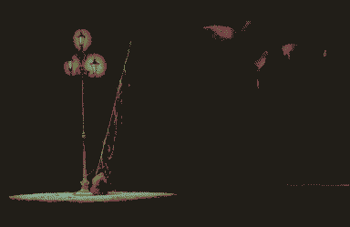

# Argyle

desiccated water level - a crater remembering how to be an ocean. 

Houseboat shanty towns amongst absences of icebergs. 

ghosts of bycatch reanimated in plastic

> (Under sleeping seas
> the net spread taut
> and ready for its grim haul;
> there is barely a ripple)
> 
> 
> (under sleeping seas the net
> tightens, closes. There is barely
> a sliver of light to illuminate
> the mute, minute
> diminishing
> ripples)

## calenture dream
[Rain](Rain.md) is sailing across the Argyle. They 'wake up' in the middle of the night and it's so cold that they're hallucinating. They imagine that their boat is afloat on a sea of reeds. They reach their hands into the reeds, and unconsciously lean overboard. The reflection of Phobos shimmers across the reeds. The calm sea starts to ripple, then waves start to knock the boat around violently. They're bucked overboard. Lost amongst the reeds, they start to panic, time accelerates, the reeds wrap around them, forming a [Monolith](Monolith.md). The next morning they're washed up on the Western beach of Whibayganba, next to the corpse of [Teran](Teran.md)