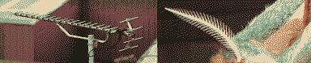
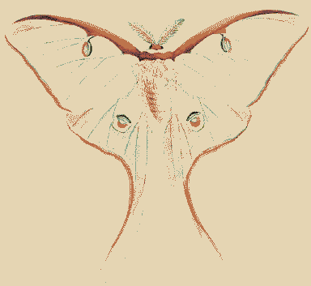
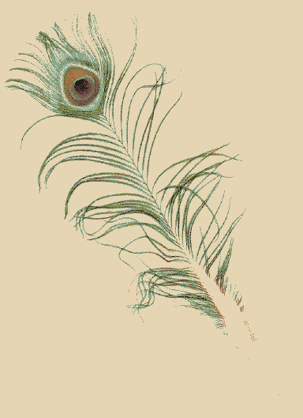
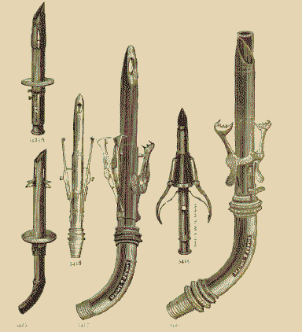
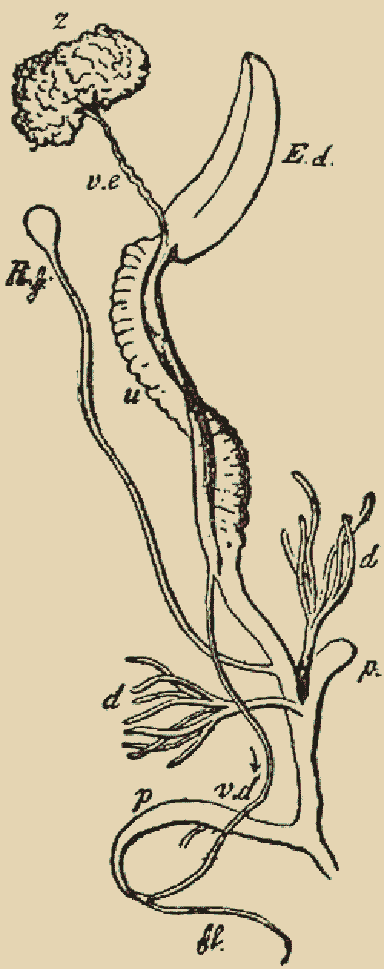

# Cephi

Cephi's an otherworldly wonderer, blessed with lepidopterativism on a particularly uncanny version of Earth (for context - see [Scout](Scout.md)). She was called to this version of Mars by the wishes of the [Concrete_Forest](Concrete_Forest.md). Cephi's body was reshaped by their desires, but she's escaping that and reclaiming her body for her self. Cephi is gender euphoria and forgetful forgiveness! She's mostly a nudist aside from sometimes masks, body paint, cool things in her hair. 

She [dreams](dream.md) of greener, slower things.

She remembers being born on Earth,  senses that things are really *off* - the 25 hour days, the chaotic twin moon cycles discoordinated from the menstrual cycle. She has a deep-seeded-sense-memory that [Luna](Luna.md) might be reborn, maybe, or sung into a closer orbit. Cephi has a tail coming from her crotch, ending in an eye that shows Luna's current phase. She undergoes different stages of a memory/rebirth cycle in sync with the lunar phases.

By the light of the Full Moon, her body is translucent like a glass frog. She has no mouth, but she can take off her head and dance with it. Her slender feather/antenna tail curls around her shoulders expressively. Her crotch blooms with aposematic wings of a luna moth/tiger flower. Cephi is at peak memory-loss - a tabula rasa! She sees a staircase of moonlight and follows it across the saltpan, almost every time finding her way to [Enyo](Enyo.md). When an anxious archivist, concerned with remembering everything, meets a curious tabula rasa, what would they talk about? Each time Enyo could try out a different script, be a different person!

One night her usual wandering is disrupted as she meets [Rain](Rain.md) on the path.

By the light of the New Moon, her body grows iridescent RGBA fur. The memories of her traumatic birth show on her body. A scar-seam is illuminated on her face, to tear along when she needs to scream. Her tail appears like gynaecological prongs/wire growing around inverted hermaphroditic sex organs, all dragging heavily behind her and  [calcifying](hardening.md).

