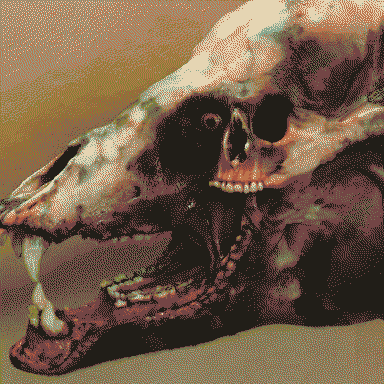

---
aliases:
  - trans-Utopaean highway
---

# a forest of concretions

Dense [Monolith](Monolith.md) resembling invasive trees growing over the trans-[Utopian](Utopia-Planitia.md) highway. **Big roots to dance through!**  Wild transhumans have formed a pretty symbiotic relationship with Monolith here, allowing them to become not-quite-[eidola](eidolon.md) - transforming their bodies without dying. Their desires to transcend their humanity and live as an atavistic *animalistic*  form of culture reshaped their bodies through concrete metamorphoses. An invasive species yearning for indigeneity on a dead planet.

They desired the next generation to be transhumans that are strange from birth and don't need Monolith to reshape their bodies - then [Cephi](Cephi.md) appeared, but she was stranger in ways that they wouldn't tolerate and they mutilated her body to fit their vision.

## Alpha
big lusty monster man, [bwusagi](https://toyhou.se/3566799.bitchman/gallery ) energy. has a harem of monsterboygirls. quietly (violently) flamboyantly patriarchal - peacock feathers everywhere, which are wonderful at first glance, but represent the dreadful, performative, invasive, [simplified](simplifier.md) masculinity that undercuts their culture.

tricolour groups of peacock feathers - the angle of each feather in the group determines the colour of each fragment in a far-from-pixel-perfect imitation of an LED screen, to broadcast aphrodisiac agitprop.

> White roses we follow, towards Teller's Hollow
> Dead earth to a spring, the house of a King
> A sip from the chalice, we enter his palace
> Break bread for the Keeper, now we descend deeper
> Washed clean in his pool we fall under his rule
> Away from what is, we all are now his

At the time [Rain](Rain.md) wanders in, the folk are dreading the arrival of the [Nuckelavee](Nuckelavee.md) to challenge their [Alpha](#Alpha). If Rain decides to let that play itself out, they come back later to face the Nuckelavee, it has the previous Alpha’s skull embedded in its antlers - they've missed the chance to help them and led [Cephi](Cephi.md) astray from helping her people, and they're [festering in their own desire](CARRION.md).

## I've sorta shared a dream with E in the forest?

misremembered...

A monochromatic world. Sunbleached rocky landscape with a lone grey oasis, an unbreaking storm above. Like a desiccated Arnold Böcklin painting. The clouds part only just around the forest for a large black spherical mass that casts it in shadow. Shadowy people flit silently between great stone trunks, peak from behind gaps in bark and congregate beneath roots. There’s a symmetry to the stone canopy and roots. Between the branches hang black many-jointed limbs, swaying like vines, fingering anything they bump into, hands creeping and wrapping around trunks. Someone sits on a high branch, watching a fishing hook very gradually lowered on a line stretching into the clouds. They slow their breathing, then sharply inhale and reach out to it. An arm snakes itself around the branch, its many elbows creaking and popping at different angles. The person pierces their hand on the hook and lets out a tiny cry. The hook’s line tenses and starts to pull its catch up through the canopy, but their foot is stuck. Drops of blood fall from their hand onto the arm’s dry skin, the red being the only hue in this world.  It loosens its coil around the branch and yanks the person back to the branch, then constricts and very quickly suffocates them. As the arm is preoccupied someone else dashes down the branch and leaps for the hook before it leaves the canopy again. As they are reeled up through the clouds they’re granted a clear view of the black mass of limbs in the storm. They see its latest catch limply enveloped by it. Safely out of its reach, they exhale hard and let out a cry. They wipe tears away with their free hand and look up, following the line through the clouds to its origin, the moon. A streak of blood down their arm glistens in its light. Their tears flow freely with elation as they swing amongst the constellations of hooks. 

(From E): The only real details I’ll add is: 

1. You can’t escape the calcified forest. In my dream I wasn’t sure why, maybe walls or impossibly steep cliffs, or just too big. not clear. 
2. No one knew where the fishing lines go, but it’s through and out, and that’s what mattered. 
3. The forest is calcified, so no food can be foraged, only what people had on them in the place (or the people themselves) some of the people are animals. 
4. The hooks typically go in your mouth like a fish. 
5. Some people tried to kill you whilst you were being reeled in, you’re a sitting duck in the air. 

In the dream I was a bipedal rabbit. Not clear why. Some people were like maybe some kind of ghoul? I think it was something along the lines of if you don’t think about eating you don’t have to, and you just slowly fossilise instead. The rabbit was really annoying because my fur kept rustling 

I had a vague sense that the arms always knew exactly what was happening, and where very intelligent, but we’re only allowed to “act” if you made a noise 

Sometimes the limbs just cut the fishing line and let you fall. One of the vague characters in the dream had fallen into a hollow stump after being dropped and couldn’t move, I just talked to them through a whorl in the wood. 

It’s not explicitly told within the dream, but the vibe I got it everything has a very specific, niche set of rules you have to follow or else. It’s like an Alice world that’s been left half functioning for 10000 years and the weeds got in. And now suddenly people start showing up here.

The forest doesn’t want to let people move around and disturb its remains.

I feel like it’s supposed to feel like the forest is against everyone within it, unless you just do nothing. Grander explanations for why/is it really? And like,,, was it built/are the limbs intelligent/were the trees ever real/how does the forest keep you here/why did I become a rabbit are purposely unexplained. 

The “intelligently against you” is def my brain doing dream logic. Like I dread “oh gosh the fall didn’t kill that mole person” and yup it did not. 

But it wasn’t all entirely bitter. Some people were nice and friendly, some just sad but didn’t want to let you know. It was a lonely place and I think everyone in it (animal or person or between) on some level needed connection. 