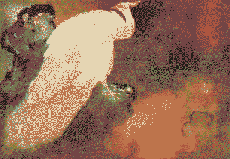

# Enyo

Enyo is a dreadful puppeteer and dancer, raised as an actress, she doesn't know when she's acting. She drowns out all surrounding signals with her own [pirate radio station](radio.md), a sinister frequency [yearning in mono](Eris-Enyo.md#yearning%20in%20mono), broadcast from a [giant wreck](Brigantine.md). A sadist perpetuating a puppet ball, luring wanderers aboard for a front-row seat to watch [Eris](Eris.md) fuck the planet.

She's an anxious archivist, having spent years isolating herself in her wreck, feeling paralysed by having access to worlds of knowledge, obsessively fossicking the [oncewaves](oncewaves.md). She [dreams](dream.md) of old lost songs that she might find. She has a time tracking system she ignores, that makes her feel great shame, doubting that she is capable of anything she dreams of - of acting for herself. Occasionally, she gets visits from sand sailors who have their own archives full of hopeful futures to offer her, but she feels such great envy at them that she won't accept any of their help. She's trying to make sense of the world through lossy archival rabbit holes, but none of it makes sense on her own.

> Grant me one last wish?
> 
> Life should mean a lot less than this.
> 
> Grant me one last wish?
> 
> Life should mean a lot less than this.

a pet project of Enyo's is to try and catch [transjovian-transmissions](transjovian-transmissions.md), but she'd probably need [all the planet's remaining power](Pazuzu.md) to decrypt a single song. She's pretty sure it's all AI generated garbage anyway, but she’s morbidly curious.

Enyo looks like a doll (geisha/barbie reference), with genetically engineered features, uncanny symmetrical freckles that resemble makeup. Often dressed in only sheer dancing silks, burn scars just visible everywhere but her face, arms and feet. Her shark smile shows dreadful sharp teeth, barbed spikes from a nuclear waste landscape.

In Enyo's dance she combines voguing with butoh. Swinging haphazardly between long and hyper-controlled movements and hypnotising contortions Like an unstable wind turbine burning out with a dreadful momentum.. Making puppets dance lewdly with each other. Biting a front-row audience member's throat out.

> A wish/desire would be accompanied with body movements connected to it, or vice versa: A body-mind relationship.

Enyo had her limbs stretched from a young age to increase her flexibility for performance. The modifications were taken even further in her adolescence with the addition of extra synthetic elbow and knee joins, with holes for ropes to hook into. A puppeteering mishap led to her losing her right forearm, which makes it look like just a regular single-elbowed arm but missing the hand, rendering her silhouette even more sinister. She's fossicked plasticks from the dead ocean floor around her wreck and sewn them into her left arm/upper chest, like a silky moth wing.

> [where are my sisters?](sisters.md)

if you squint, her name looks like Envy. [amputated left hand to the King.](Eris-Enyo.md)