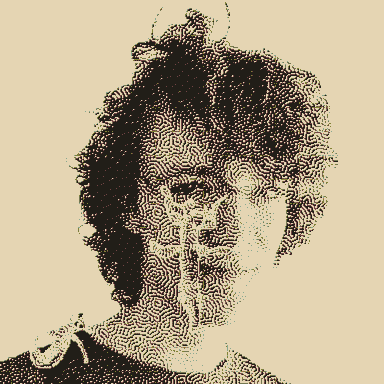

,---
aliases:
  - Eris and Enyo
---
# I'd eat a planet for you

(notes on [Eris](Eris.md) and [Enyo](Enyo.md)'s world-freezing relationship)

They're post-trauma children of the wasteland, both raised/mentored by [Val](Val.md), in their young adulthood - he exploited both of their submissive upbringings. Eris was part of a military-industrial-nuclear-not-family while Enyo, who came into the picture later, was raised in [a religious-theatre-sisterhood](sisters.md). These backgrounds mirrored and intermingled in a boiling pot of escapist interdependency. They're *sisters* in a sinister cult-y way, like how two nuns educated together would refer to each other as *sister* (and like nuns, they've fucked and made everything super complicated). 

They each mirror/put their faith in Mars' moons in different ways. Eris believes [Deimos](Deimos.md) is the one true moon, and that [Phobos](Phobos.md) is a pretender and their doom, so she means to destroy it. Before they parted ways, Enyo learn some of the old ways of astronomy (but far too late to convince Eris otherwise), coming to understand that Phobos will break up peacefully when it gets too low in orbit, and that Deimos' orbit is on escape velocity, so putting faith in either will lead to despair. Enyo inhabits this despair, knowing Deimos will carry [Monolith](Monolith.md) to another system and not wanting to burden anyone else with this knowledge. Maybe she put her faith in gravity but learning that even that isn't outside of Monolith's influence - nothing makes sense any more. She keeps her hope neutered, instead, dreadfully dancing, embracing absurdism. Maybe she'd have a lot better time if she knew she's not the only one [dancing at the ends of worlds ](saturnalia.md). Like Deimos always being evoked after Phobos, Enyo doesn't mind playing second fiddle to the scariest bitch on the planet. Enyo actually prefers being a witness, because Eris desperately wants to be witnessed.

## dykaiju
They're each a dis-aster in their own right, and maybe they can fuse to get so much worse. an imbrogliato of monsterdykes. Glimpsed only **in silhouette** in the weathered remains of [Utopaea](Utopia-Planitia.md), a big barbed entanglement of twisting, many-jointed-limbs. Chrysalis-ised, maybe they contained [the storm](storm.md)? A new stasis, conjoined for ever.

I miss these buggirls. They would constantly spend their days entangled, with nothing better to do. They found rest amongst delicious hydrating eucalypt.

## *when we were yet unnamed we dreamt of escaping to Neptune. have the plans drifted so far since then?*

The disasters have been acting out their escape from the planet since they first met, making it more and more elaborate, entangling their futures so much that they can't picture being without each other. In Eris' absence, Enyo has been escaping into these dreams, playing them out over and over again.

Eris drops in on [The Brig](Brigantine.md) every so often with more dreadful things for her armoury/peep show. Enyo starts to realise that they won't make it to Neptune with all this violent junk aboard. How does razing [Utopaea](Utopia-Planitia.md) fit into their dreams? It's never been in hers. Enyo still dreams of them hopping between the little orbital islands that were Kronos a generation ago - dancing around the remnants of time. They've always dreamt together, but lately she feels Eris' presence less and less. She [grows stonier](hardening.md), moves slower, gets lost among the debris. Eventually it's all drifted too far apart and Enyo can no longer recognise what was the moon. Drifting into a ring, waiting to rejoin, Eris' calcified body an insignificant orbiter. Her growing despair accelerates the Brig's dilapidation - it rusts and shatters, collapsing on her as she dances what she wishes would be her last.

> This is the last dress rehearsal 
> 
> To stand back, morose, a human clone   
> 
> So, for what is left, I'll tag along
> 
> I'll play the part of someone I like
> 
> That mirror, mirage
> 
> That mirror, mirage

## yearning in mono

they each keep a quiet pirate [radio](radio.md) station running. sharing just one channel of a song and wishing for the other half. a/symmetries; [stereo mind games](https://www.youtube.com/playlist?list=PLw1GeAARDUgWnJxpO6q8WoTHwAI7rpXls).

if Eris is *Dream Loss*, Enyo is *Alien Observer*.

## trybikes

A great rusty marcher with a globe and LET IT DIE [spray painted](graff.md) on the side in blue lichen.

every thing has a wonderful aspect and a dreadful aspect to it. I think wonder and dread are both open, imaginative feelings, that are self-sustaining and unresolving. they both have twins yearning for your attention in the eternal present, which wish to be unresolving, too, but are useful precisely because they can resolve - wonder's twinned hope, dread's twinned fear. the fear of Phobos will resolve, but the dread of where Deimos is headed will never resolve. The hope for a more liveable planet will resolve, but the world will never cease to be full of wonderers.