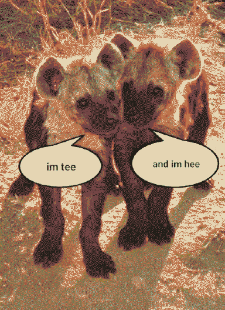

# HARUSPEX OF ROTTING PETABITS

Eris yearns to collect spite, project terror and sow chaos, so much that it reflects back on to her and reinforces her ideal world. she's the dreadful semaphore all the worst shit. King of all those people having the worst/best time at the ends of worlds. maybe following Rain's scent they're led to the Menagerie to collect megafauna, moreterrible teeth and terrible claws for the [warband](#warband).

An iron-daddy hermaphrodyke - Eris is 7 feet tall on a bad day. She has vitiligo, and so the changing of her appearance in [dreams](dream.md) grounds (or confuses) them in the timeline. Her hair, shoulders, lips, are all fried from radiation and other traumas, cracked and grey like dried earth, numbing her to pain and cold. When she does wear covering clothes it's for vestigial cultural reasons - ceremonial post-military regalia.

> (transcript of an old tumblr post)
> ~teaboot: I love "gender bending" characters but HATE HATE HATE designs where canon buff dudes are wispy little fairy ladies and canon tiny women are beefy ass male linebackers. If you're not in it for JACKED WOMEN and TWINKS then what's what's FUCKING point
>~coughcoughwheeze: gender bend where they look the exact same except they have a sticker slapped on them that says 'woman' or 'man'
> [image of Bane from the Dark Knight with a yellow sticker saying WOMAN slapped on top.  Bane is a ridiculously muscular bald person wearing a military jacket and gimp-gas-mask.]
> ~teaboot: you understand my vision

Raised by [Val](Val.md). Eris continues this cycle of violence by taking kids from lost cultures and raising them as [Hope-Eaters](Hope-Eaters.md), including [Rain](Rain.md).

Eris **loves** to feel in control, to feel that she has power over people, that she is changing them, bettering them, leading, [writing their scripts](Eris-Enyo.md). Her sowing chaos means that her mind is the clearest - a dominating will to reshape the world. If she's growing impatient crossing a mountain range, she'll sleep on it and in the morning they'll be behind her. 

Her ways are sinister and not often physically violent. She prefers to have others on a leash, enacting violence for her because she's led them to believe it's necessary - [simplifying](simplifier.md) their world into a dog-eat-dog-eat-dog-disorder. She particularly loves to collect dreadful [dog-like-things](dogs.md).

## HAIL HAIL HAIL HAIL HAIL ERIS ERIS ERIS ERIS ERIS 

She's named for The Goddess but really more in the fashion of *Principia Discordia* - no one really takes her that seriously.

## warband
>  A Long March (Until Time Collapses)

As the [Hope-Eaters](Hope-Eaters.md) march on, they collect more lost souls. They bear signal jammers, anti-sirens and other interferometers, so for anyone tuned into the [radio](radio.md), they are heralded by dreadful silences. The pack grows rapidly and chaotically, from confused mammals keeping each other warm with their spite, to a great machine animated by terrible purposes. They march to raze [Utopaea](Utopia-Planitia.md), but might lose themselves in the shadows of the colossi they've recollected. [CARRION](CARRION.md) festers in their wake.

- through [Valles_Marineris](Valles_Marineris.md) and the underground cities to uncover terrible weaponry (microplastic carrion flies?), and legions of seeking hands.
- the pack grows hugely if Eris is led to [Menagerie](Menagerie.md) - to collect more carrion eaters and megafauna-warcraft-carriers. A great red Megatherium takes up their banner, a slow pace-maker.

In Eris' long march she's been laying barbed wire fences everywhere, dividing up the land without a plan. She wants to be the mediator for all networked communication, hence why she's silencing [radio](radio.md) and clogging up people's dreams. When everyone's enclosed in her fences they can be used as telephone networks and everyone can be tuned in to her bossiness all the time! That'll fix this fucked up situation they're in, for sure :]

Eris' pack all wear barbed wire bracelets around their wrists. Her willpower over them is so strong that it doesn't need to be directly wired up to telephony.

> They said, "We make friends just to have more projects"   
> We make friends just to turn them into enemies