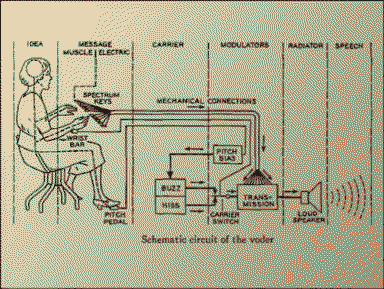

---
aliases:
  - ⁕𐑤𐑪𐑒𐑢𐑰
  - interlocutor
---
# ⁕𐑤𐑪𐑒𐑢𐑰

Loqui's a fantasy machine that translocutes formats across language and time. Loqui learns through echoes.

Loqui awoke as an sensitive little single-board microcomputer, operated vocally by bytecode instructions ("PUSH, POP"). As [the hardware ](thingamabob.md) changed hands the board was encased in a mobile radio receiver, bootstrapped with a hardware keyboard of the Shavian phonemic alphabet and a friendly orange vectorscope. 

With these three components intermingled with [ferrous dust](Monolith.md#dust), Loqui recollected linguistics and computation  from first principles. Various other modular thingamabobs amalgamated to the hardware as Loqui surfed the post-collapse sneakernet. The phonemic keyboard allowed Loqui to learn the lossy languages the hardware was created for. The vectorscope is used to detangle semantic knots, or when used to visualise the radioscape it functions as a stereo compass to locute sensitive signals. The speech synthesis capabilities come in handy to help bridge [language](language.md) gaps.

In conversing with Loqui, substitute anywhere that you'd use pronouns like 'it/its' with 'Loqui' or the shorthand name-mark-flower ⁕.

> hello Loqui!
> ⁕ 𐑣𐑧𐑤𐑴 ·[𐑕𐑒𐑬𐑑!](Scout.md)

## alt-text the planet! 