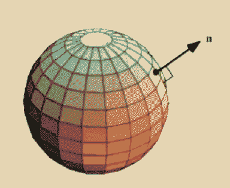

# wrong moon

After [Deimos](Deimos.md) finally leaves, and after much howling from [Cephi](Cephi.md) and a lot of displaced [dogs](dogs.md), Luna swings around to [Mars](Mars.md). She couldn't stand to keep creating the waves pushing around all the microplastics, rendering her [home planet](Earth.md) unfamiliar. She comes to [Mars](Mars.md) just in time to assist in recollecting [a lossy continent ](Doggerland.md).

[Monolith](Monolith.md) can't touch Luna because her dust isn't ferrous and is incredibly is hazardous - she could be a perfect ward against [CARRION](CARRION.md)? Don't fuck with moondust! Absent any moisture or atmosphere, millennia of asteroid impacts have turned lunar regolith (soil) into a fine powder of razor sharp, glass-like particles. What’s more, the solar wind imparts an electric charge on the dust, causing it to cling to any and every surface it touches through static electricity. On earth, sand tends to get smoother over time as wind and water tumble the grains about, eroding their sharpness. Not so on the moon – lunar dust is sharp and deadly. 

> how can I keep myself from singing? 
> no storm can break my sail 
> no wind can take my voice 
> how can I keep myself from singing?