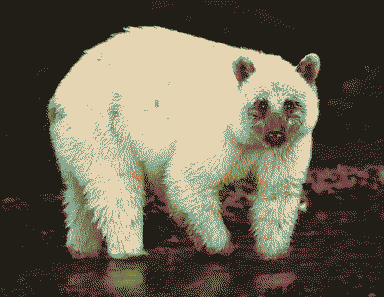

---
aliases:
  - megafauna
---

# this forgotten petting zoo; it's no longer built for you.

A zoo full of replicas and recordings of [lost Earth](Earth.md) species. Broken loops of bird song, animatronics [recollecting ecologies](echosystems.md), taxidermy talent shows. Megafauna clones wander all over the planet, from horrifying failures of rewilding experiments. There's a big [baobab](Monolith.md) thriving in the centre of the facility, probably. 

(That replacement of the word *extinct* with *lost* was a really gut-punch, thanks me. Implying ownership and responsibility of these species, perhaps - thinking naïvely that ecologies can be reinvented [around humanity](post-anthropocentric.md).)

We filled these [idols](eidolon.md) up with so many wishes, but we couldn't remember the originals well enough, and now they have other things to wish for. The puppets and clones and robots taxidermy are all commingling, converging into some inbetween form.

> Ailing am I,
> in cage of twisty wire,
> cold concrete.
> MOURNE Ache YEARN
> 
> Known you not that my heart is a forest - 
> run with me through trees of striply bark,
> run with me over creeks of flickering fish,
>
> run with me where the snow falls slow.
> 
> from *The Dream of the Thylacine* by Margaret Wild and Ron Brooks

[Rain](Rain.md) encounters a sad old unicorn and her wind-up birdfriend, following their songs to this facility.

the [primates](Rooney.md) have taken to ripping their faces off:

> That body belongs to someone else. It wears a mask. Just a mask.
> Take the mask off. 
> Reach down and touch it. Good. Now take it off.
> Pull harder!
> This imposter is clever. The mask is affixed. You must cut it free. Take this blade.
> Do not hesitate. Do not poke! Chop it. Smash it!
> Yes… good. More. More. Wet your hands in this impostor's gore. Spread it about. Good!
> There… you have it now. You have removed the mask…
> Does that look like your body now? No. It is an empty thing.
> I will take this mask and clean it. When others wear it, you will not see your face in it. You will know it is a mask.
> 
> from *[Mask of Bakris](https://www.ishtar-collective.net/entries/mask-of-bakris)*

## Chimera 
A Gigantopithicus with a giant alligator in place a tail, a crustacean instead of one hand. Its rotten skin has been patched up with reanimated leather jackets - a tail made of snakeskin boots. Huge knots of red hair falling off of an [ossified](hardening.md) armature. A pride of pale lionesses suckling at its sickly teats. 

Maybe she *is* the Menagerie? yearning to join into some thing that makes a new kind of sense for these imitation ecologies.