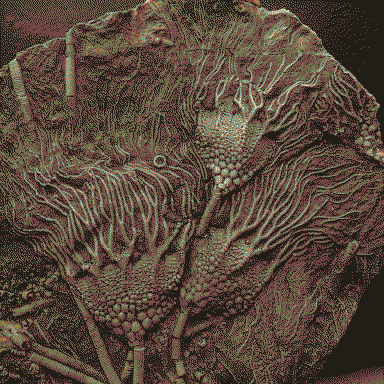

---
aliases:
  - wishcycle
---
# Monolith
Monolith is a colonial not-organism that has been on [Mars](Mars.md) for a while. Monolith is not a living thing, but an incredibly *sensitive* thing - not inherently sinister, but uncanny, **other**.

Monolith inhabits *unreal* media (feelings, intentions, wishes, memories, [dreams](dream.md), desires, traumas, stories, cultures, *imprints*) and manifests **mimesis+symbiosis** through *real* media (biological, geological, ecological, [electromagnetic](radio.md), gravitational).

This has the most immediate affect in breaking down the difference between psychogeography/geography (areography?). Monolith animates the quietly violent imprints on the landscape - e.g. of surveillance, alienation, kettling - or reshapes it to make sense of the strongest memories, desires.

Maybe Monolith is responsible for filling up the [oncewaves](oncewaves.md) with dreams, or maybe dreams are inherently [electromagnetic](radio.md), and [IT](CARRION.md) yearns to become the sole medium for all dreaming

## wishcycle

Monolith makes [the actors](cast.md) wishes real - whether they're conscious of these desires or not, whether they say them out loud or not. The muddied, commingling desires of collectives are particularly potent - they remade and continue to remake [this dead planet](Mars.md). 

v inspired by cognitohazards:
> The mind is malleable, filled with transient and fleeting ideas. Let us shape it, so that you may see the infinite splendor of the universe.
> It's suffocating here, this prison. Do us a favor, o bearer ours. Still your mind; invite us to enter the realm of your capricious thoughts. Your mind is vociferous, addled with worry and doubt. We can extinguish these trifles. Would you like that? 
> Yes, we are here. We are not the photons on your screen, or the voice in your head, or the words you read. Shut your eyes—tightly—and you may see us. At least a part of us. Make us real, and in turn we shall reify your thoughts, your dreams.
> - [Claws of Ahamkara](https://www.ishtar-collective.net/entries/claws-of-ahamkara#ahamkara)

Destiny's Ahamkara appear as they are imagined to have appeared, loaded with cultural expectations of what a dragon should be. Monolith's networks branches adapt to what they *expect* an invasive network should look like? Changes appearance to fit different  [imitation ecosystems](echosystems.md) Baobabs, mangroves + paperbarks, eucalypt, radio antennae.

## origin ?

I dream of the journey of the first seed, riding on solar winds and getting caught on [a little spud](Phobos.md), which eventually wound up getting caught in the [Mars](Mars.md)/[Jupiter](saturnalia.md) gravity well.

[I dreamt of a trinary star system](asterasteraster.md).

[I dreamt of a morning moon](Deimos.md)

### dust

The Medusa Fossae formation is a ferrous rock that is a lot smaller than it should be considering its impact crater, so areologists reckon it's been around for a long time. Rather than an oxygen-rich atmosphere and a Water Cycle to make red rusted iron, Mars has a Dust Cycle. Over billions of years its high winds have been eroding away the Medusa Fossae Formation with wind, producing enough hematite dust to colour the planet red.

I've had a contradictory but juicy thought for a while that Monolith is an iron-based organism, subverting the belief that carbon is the foundation for life. That Monolith sung down the Medusa Fossae to bless the planet with red sands, and waited for a dreaming host to follow that red blinking light.

> He figured that alive and in the Devil's pocket was better than dead, so he shook her hand. The Devil opened her eyes—one, two, three—and pointed him to the last star in the sky, far to the south. She said, "That's your star, Sean Rigby. Follow it each night, when it's the last star hanging low, and sing to it. You sing, 'Al Eck Ruk Nam, Shu Nam Eck Ur,' until you call that star down to Earth. You do that, and your family will endure." 
> - [The Last Midnight Star](https://www.ishtar-collective.net/entries/fundament-shell)

This dust extends Monolith's *sensitivity* to the things it inhabits - leading to constant interchange of information between mediums. A [thylacine](dogs.md) pees on a [lost  gameboy](hermit.md) and it spontaneously generates a retrobreeding game.

Red sand around Monolith gather into structures resembling a nerve system. Where the wind has uncovered the bodies buried beneath them, the growths can be seen concentrated in the bone marrow.

I love seeing those iron/salt scribblings (e.g. on a shower rack) that resemble xyloglyphs. What if Monolith had scribbly gum [ferroglyphs](ferrodoxy.md) that manifest into its branches? 

[graffito](graff.md) as a form of wishing. 

### obelisks
> These mysterious bits of genetic material have no detectable sequences or even structural similarities known to any other biological agents. 
> Stanford University biologist Ivan Zheludev and colleagues argue their strange discovery may not be  viruses at all, but instead an entirely new group of entities that may help bridge the ancient gap between the simplest genetic molecules and more complex viruses.
> "Obelisks comprise a class of diverse RNAs that have colonized, and gone unnoticed in, human, and global microbiomes", the researchers write in a preprint paper.
> Named after the highly-symmetrical, rod-like structures formed by its twisted lengths of RNA, the Obelisks' genetic sequences are only around 1,000 characters (nucleotides) in size. In fact, this brevity is likely one of the reasons we've failed to notice them previously.
> These elements might not even be 'viral' in nature and might more closely resemble 'RNA plasmids
> The question of the Obelisks' source aside, all seem to include codes for a new class of protein the researchers have named **Oblins**.
> Instructions for building these proteins seem to take up at least half of the Obelisks' genetic material. As these proteins are so similar across all the Obelisks, researchers suspect they may be involved in the entity's replication process.
> However, Zheludev and team couldn't identify any impact of the Obelisks on their bacterial hosts, or a means by which they could spread between cells.
> These elements might not even be 'viral' in nature and might more closely resemble 'RNA plasmids'.

- ['Obelisks': Entirely New Class of Life Has Been Found in The Human Digestive System : Tessa Koumoundouros, ScienceAlert](https://www.sciencealert.com/obelisks-entirely-new-class-of-life-has-been-found-in-the-human-digestive-system)
- [Earth's earliest and deepest purported fossils may be iron-mineralized chemical gardens - PMC](https://pmc.ncbi.nlm.nih.gov/articles/PMC6939263/)

### primordial
> Life arises. Life spreads, contests itself, and changes. Great things are built and destroyed, but from your vantage point, you see that the victor of each struggle contains—in its negative, in the marks left upon it by the loser and the shapes it assumed to win—the master record of all that it has beaten. Information may not be erased. Whatsoever survives until the end of the cosmos will possess and remember all which came before it.
> 
> This is true even of the devouring black hole, which remembers all the secrets it eats. It will only confess these secrets when it evaporates, 10 000 000 000 000 000 000 000 000 000 000 000 000 000 000 000 000 000 000 000 000 000 000 000 000 000 000 000 000 000 000 000 000 000 years from now, long after the last stars have flickered out.
> 
> 
> You are a Guardian. You must protect life.
> 
> If all life is information, and Guardians strive to preserve life, and information is preserved when it is secret, then you must convert all life into the most secure form of secrets, durable to the end of time.
> 
> YOU MUST CAST ALL THE LIFE YOU CHERISH INTO A BLACK HOLE

- excerpt from [Truth to Power](https://www.ishtar-collective.net/entries/you-must)

## etc
I've often characterised Monolith as seeking, exploiting, *preying*, in the same way humanity can. But I think that - unlike coloniser's justifications of violence that seeking new frontiers to conquer being in our *nature* - this exploitation truly is Monolith's nature. Maybe exploitation isn't even the word, but I think some aspect of that is natural: that a being must take from its ecosystem, and when it doesn't understand its place in that system, that it will take too much. Monolith just seems so out of place because, like humanity, Monolith is displaced from any sense of a home, an origin; [displaced in time](time.md), too, maybe perceiving it non-linearly, in everything all at once. Monolith can't dream alone, needing hosts to tap into the species' collective memory through vicarious visions and emplace the present. Monolith fucks with time in every way but the *literal*- chemical, gravitational, perceptual, cultural - obliterating scientific perceptions of time.

I don't think Monolith is [an actor](cast.md), but a powerful animating force that the actors can try to scapegoat, that holds a mirror up to their desires, memories, traumas. Monolith can use any medium as a host and just happens to be thriving on a planet loaded with so much melancholy, despair, trauma, memories of [unimaginative utopias](Utopia-Planitia.md). 

Monolith is always singular in [language](language.md), referring at once to a limb of the network as well as the network itself. Monoliths plural seems silly to say, maybe even [heretical](ferrodoxy.md). I don't think Monolith needs to be proceeded by 'the', just Monolith. The pronouns it/its are not used to refer to Monolith, because othering is taboo. So there is a dark linguistic shift when **[IT](CARRION.md)** is started to be used to refer to some thing infesting the network, unremembered nightmares..

Monolith's physical manifestations are just referred to as *branches* - which look like inverted root systems of an ever-[hardening](hardening.md) material that is at once **shell+bark+iron+stone+bone**. Perverting animism, the landscape around Monolith starts to [imitate life](eidolon.md) using any materials that are just past the threshold of what Monolith's host considers life. Rebar in a building in [Utopaea](Utopia-Planitia.md) tears out of the concrete and grows to resemble the vestigial wings of animals that used to live in the city. Predatory pareidolia.