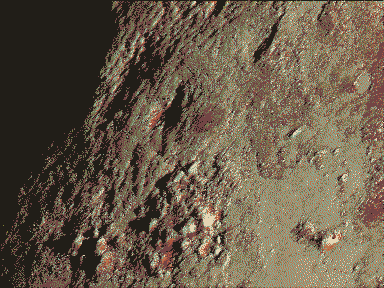

---
aliases:
  - first wish
  - altered orbit
  - Phobos Dreaming
  - Phobos will fall
---

# first wish/altered orbit

among the first nuggets of ideas for dreams_of_a_dead_planet was exploring the pseudoscientific conspiracy theories around the suspiciously uniform monolith on Phobos. here's some ancient kinda cringe ideas....

[Val](Val.md) was the first manned expedition to Phobos. [Monolith](Monolith.md) wakes when he touches it, and his body dies instantly. The branches of it erupt with seeds in an iridescent fireworks display. Phobos' momentum is increased drastically, an unexpected *allegro* in its gravity-song, bringing its death years earlier. His wish for a [utopia](Utopia-Planitia.md) travels as a seed to the surface of Mars (is this also his consciousness simplified into this terrible-purpose-form?). This is seen from the perspective of [Rover](Rover.md).

The dream could be mashed up with some of [Rain](Rain.md)'s earliest memories. Maybe this is a recursion of *The_Shogun_of_Tharsis_Basin*, the moment their parents were executed and they were inducted into the [Hope-Eaters](Hope-Eaters.md). The imagery of the seeds bursting from Phobos triggers a memory their parent's execution. [Eris](Eris.md) strapped all the elders to a shuttle and set it off to explode in low orbit, and they only saw it for a moment before she kicked them in the face.

Spitting blood in the sand. The blood forms into different shapes - [ferrovoyance](ferrodoxy.md)?

## recalling a dream of Phobos falling

I once had a dream that I was standing on Mars, looking up into the sky as one of its moons, Phobos, fell closer and closer towards me with every orbit. That dream-memory has always stuck with because of the raw and complex mix of emotions I felt looking up at the falling moon; dread, wonder, nostalgia and grief…

Phobos crosses Mars’ sky twice every day, and gets closer by a few centimetres every day. In 10 million years, when Phobos gets close enough to be as big as Earth’s moon is in our sky today, it will start to gradually be broken apart by Mars’ gravity and turn into a ring. At (roughly) the same time, the other moon, [Deimos](Deimos.md) will have almost escaped Mars’ orbit, and will hardly be discernible from the other stars and planets in the sky. 

But before [Phobos dies and Deimos leaves](time.md), if there are people on Mars at that time do you think they’ll look up at those bright specks in the sky and be reminded of home? And how will they feel later, when the night sky is just dust and stars?