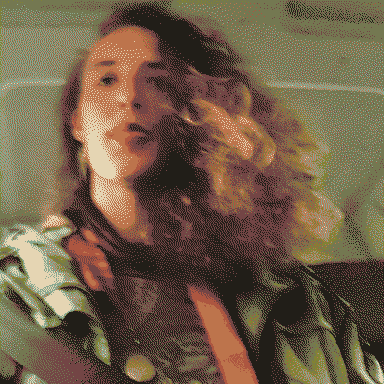
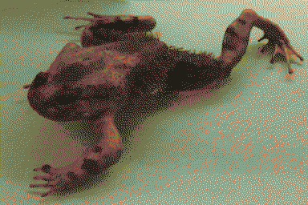
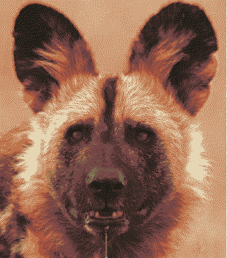

# a seeker thrice cursed by dogstars' tears

Scout's a para-zoologist exploring alternate timelines of our solar system to catalogue how evolution turned out differently. It accidentally learnt how to *step* through uncanny reflective surfaces, jumping to slightly different permutations of evolutional history. In a lot of these 'verses [[otherverses]] it caught *curses*.

Scout's first curse was amphibious, the second canine, the third medusozoan.

## get frogged idiot
Scout started off on regular ol' [Earth](Earth.md) as a batrachologist, but one day followed a particularly fucked up furry frog and fell into a puddle. On the other side of that puddle it found itself in a much wyrder planet, mostly dominated by swampy terrain and furry species. It had a lot of fun on this boggy boarplanet for a while, catching a curse that made it r/evolve like a wolverine frog - breakable bouncy bones and weird fur, hell yeah! They hopped through puddles to different planets of varying degrees of frogginess having a generally jolly time.

  
## get dogged idiot
Scout spent a while jumping through magic mirrors in medieval Earths to find the doggiest planet it could, and settled in a pretty fantastic swords-and-sworcery furryland for a while. It hung out with a cool fox knight named Lumi (?) - they flew some kites together. 

Scout got way too invested in local politics in this world's kinda-Africa and ended being bitten by a hyena-like-guy and inherits his crazy curvy canine teeth and cute neck scruff. *Hell yea, we can work with this, let's go chase some moonstairs.* With its newly heightened senses it was able to explore a nuanced variety of dogworlds. Whoops, it went too far and found dogs that have too many heads, time to jump in the ocean and get away from stinky mammals for a while.

## get bugged idiot

A very warm oceanic Earth with a small population of angels spectating from papery dirigibles. Mostly immortal perfect blubberbeings! Scout has a fantastic good time here with a distractingly pretty jellyfish, and picked up a pretty gnarly curse.

Its flesh is gradually replaced with medusozoan blubber, and its bones are dissolving inside of it. Its brain can be seen through its now translucent skull.

A siphonophorae colony is feeding off its brain and displaying/interpreting its emotions in funky nonverbal ways. Its eye cavities become membranes for 'speaking' in wingdings/textmode or any symbols from its memory.

Its teeth have become displaced in the jelly - they chitter and glide from left to right like a waveform across its fused lips. Bones are going gelatinous but hey at least you've got a massive mouth with oscillating teeth in the rhythm of your speech.

By this stage the canine teeth have grown into its skull at funky angles like a babirusa - oni mask teeth that curve inwards and back out through the jelly as spiky eyebrow piercings.

> So I was at first like actually I don't mind being a frog then I was like o hell yea I'm a weird dog now and now I'm like trying to look on the bright side of being a jellyfish 🪼 like yea my bones r dissolving but I've got extra hearts

Now, more often than not, Scout finds itself wandering weird, life-lost beaches. It is crushlingly afraid of the big wave. It keeps encountering its imaginary friend [⁕𐑤𐑪𐑒𐑢𐑰](Loqui.md) in different forms across time and space. 

As this final curse leaves its ability to dimension-walk disintegrating, I guess Scout's ended up on Mars [pretty late in the game](Doggerland.md), on some level it's seeking those lively [red stars](asterasteraster.md), same as everyone else.

> if it wanders far enough it finds edges. on some edges it finds shores, where it catalogues what it finds. sometimes it finds a [kite](skyfill.md), and it tangles around its ankle and takes it to other shores. sometimes it finds nothing. it notices the weather sometimes.