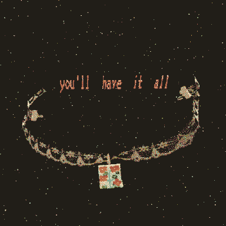

> Because of you their story will be told

> Imperfect oases of freedom.

What if information is encoded in the unique electromagnetic aura around each person - in a kind of extended gene sequence?

## IFS
My ego is made up of actors, that are not my true self. I am the universal energy of love.

These actors all have different radio stations in the whatnot that is my emotional system. Some are quite used to being very loud, having the most clearance, competing with each other for airtime. Some are used to being quiet or hardly heard at all.

They all feel great resistance to authority, even when they find themselves asserting it themselves.

How can each part be felt?

Enyo
- severe jealousy
- anxiety, inward thoughts, egocentrism.
- vacuum sealing: having too much choice for what to let in to "her world", choosing nothing.
- belief that she has to follow a script to live a happy life
- (but also, resistance to following a script)
+ talent for writing "scripts"

with Cephi
- gender envy

with Eris:
- intense shame in very abstract thoughts... "I should know more about this" 

Cephi
 

Casimir
+ love for another person, desire for connection

Eris
- rage (against authority, against defiance)
- bossiness and vague instructions: "YOU SHOULD BE ANIMATING" (animating what? how? when? where?)
- authority without a plan.
+ may find that if she merely lets all these minor characters (skills, sensitivities) collect, then a fierce march will carry on that she will hardly be able to stop.

Val
+ a gifted storyteller
+ can be given a series of positive memories to tell a new story.
- picks and chooses memories to tell stories of parts.
- depression makes memory weird!

Scrimshaw
+ the wonderful, different way of looking at things
+ real emotional sensitivity to "inanimate" things

Rain is a wanderer, who has spent a long time trying to figure out how to be alone. They can feel great shame at their tendency to wander off, but they always come back to the same places. Their imaginary friends are great tools for helping keep their own company - journals, reminders, computers. 