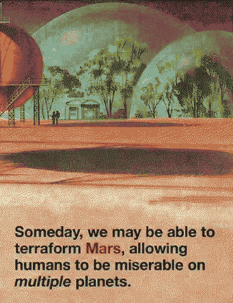

---
aliases:
  - Utopia Planitia
  - Utopaea
---
# Utopaea

Utopia Planitia, [Mars](Mars.md) was the site of the first colonies, now a broken capital city. The stomping ground of [forgotten god kings](forgotten-god-kings.md), the [hardening](hardening.md) final form of *the myth of progress*. 

> Come let's take flight, let's quit this scene tonight  
> Whilst they sleep on endless, in their wrecked designs  
> Sleep on endless in your wrecked designs

Remnants of a teleological and atomic implosion - red dunes shot through with craters of trinitite, surrounded by petrified [eidola](eidolon.md). It is the eye of [an unending storm](storm.md), ([CARRION](CARRION.md) is its fallout, or its catalyst?)

**caught in a web of billboards wrapping around you, everywhere you look**.

[Eris](Eris.md) gathers a warband and marches to raze the city.

Remaining city districts look like rain shadows, gathered concentrically away from the storm that has worn down everything else to sand. Siren calls in the winds, - echoes of incarceration.

On the outskirts, over the trans-Utopian highway, [wild concrete grows](Concrete_Forest.md).