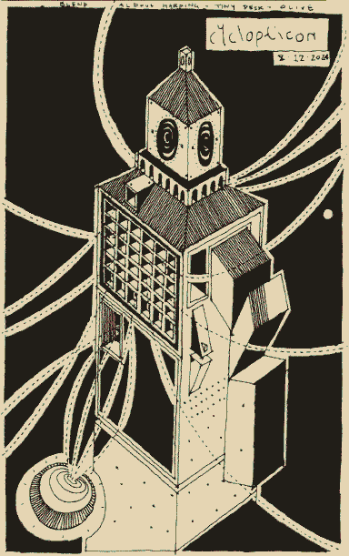
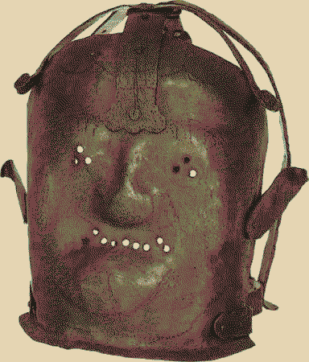
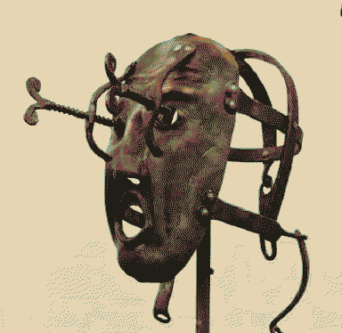

---
aliases:
  - Valles Marineris
  - Valley of the Mariner
  - Cyclopticon
  - ghost gaol
---
# Valley of the Mariner
Biggest network of canyons in the solar system, covering about one third of [Mars](Mars.md)! 

There is a giant gaol patrolling the valley, piloted by an electromagnetic ghost-goblin army collective. A Cyclopticon - a  mobile lighthouse that's forgotten its purpose. Subconsciously desiring a purgatory path to wander for ever, the giant makes the valley psychogeographically loop back on itself. The prisoners don't realise that they're all collectively piloting it, and have developed a complex keeping each other mutually trapped. They're making the most of it, though, getting to know each other through prison theatre puppet shows.

> A mask! A face! Does it need one? To define. To focus. To exist.

Fossilised coral on walls of the valley. They're fishing for bits of coral to turn to masks, using ectoplasmic wishing wire. Lots of plastic trash to use as masks, but they're second-class to coral. If they find opals it's a nice bonus - can be used to buy a show from a troupe.

[Rain](Rain.md)'s standing on a precipice, caught and yanked off by a stray hook - finds themself playing a minor part as a tree in a show.

