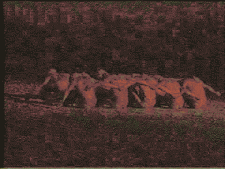
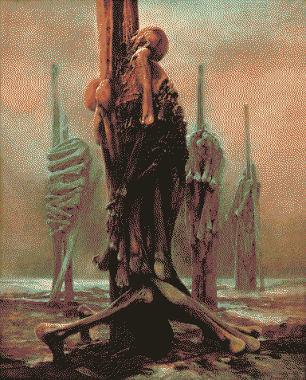
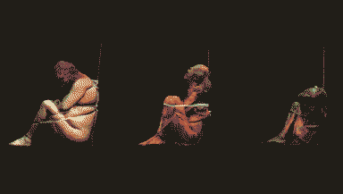

---
aliases:
  - eidola
---
# going hollow is great actually.
1. an idealized person or thing.
2. a spectre or phantom.

an eidolon is a [post-](post-.md)ghost. spirits clinging to any shell that'll house it for a time: puppets, mannequins, plastic idols, sex dolls, robots, dental ghosts, electronic waste.

These aren't suitable bodies for a human spirit, though, and any shell gradually [petrifies](hardening.md), which can leave them stuck.

Maybe not everything that is othered is an eidolon, like [Scrimshaw](Scrimshaw.md), the [Cyclopticon](Valles_Marineris.md), and all the [little hermetic intelligences](hermit.md).

There's a post-life-cycle they're caught in, which starts to become clear as a cycle as all the dusty offal they're animating starts to [converge on the same material](hardening.md), to look like another branch of the [Monolith](Monolith.md). 

**eidolon trees:** starving eidola wander out into the desert, seeking each other, following their innate human desire to *[be a part of something](ferrodoxy.md)*. [Monolith](Monolith.md) exploits this and urges them to wrap together into mock-monoliths. 

**eidolon flowers**: budding, new forms of life for [CARRION](CARRION.md): jawbones in stellate, hypnotising formations; vertebrate stems, tooth-digit seeds of despair. 

- [welcome, ghosts](https://map.simonsarris.com/p/welcome-ghosts)
