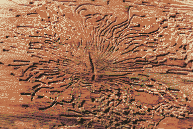

# beliefs of the iron [(people)](eidolon.md)

a [rigidifying](hardening.md) spiritual [undergrowth](Monolith.md).

ferro meaning iron; doxy meaning religion, or more simply knowledge, beliefs, gospel truth.

Part of the tyranny of ferrodoxy was that it encouraged people to make pilgrimage away from safe areas to find Monolith branches to bury their dead at. Because of this practice they would come back as eidola, and [Monolith](Monolith.md) was able to spread all over the planet. Do the dead come back because of the messiness of grief - burying people out of tradition before they're ready to put their loved ones to rest? Because they want to come back?

## ferroglyphs
an asemic [language](language.md) infected with reverence

ferro-fluid + kufesque + xyloglyphs

blood forming into shapes, like Rorschachs, but yearning to be recognised - ferrovoyance?