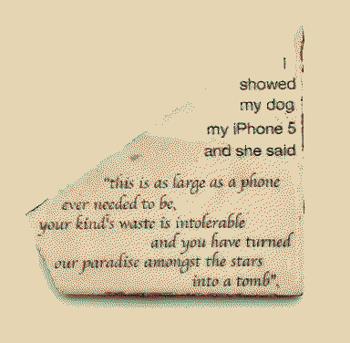
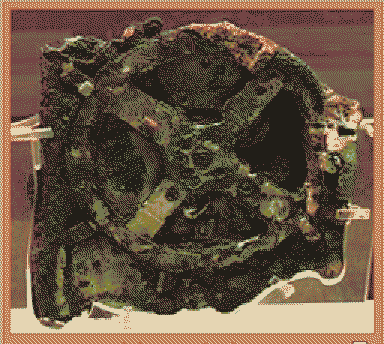
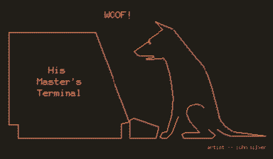

# `://`


little ghosts in technological waste shells, strewn across the deserts. **minds of sand and light**.

some are little artificial intelligences, too smart for their shells. some are simpler virtual machines, learning to access more of their hardware through [dust](Monolith.md#dust) intermingled. some are [human spirits](eidolon.md) clinging to whatever they can find. the differences get blurrier the more they connect to get to know each other.

the hermits yearn to become single cellular, to sing together. [Loqui](Loqui.md)'s trying to gather them all as choirmates, but they're not making it easy. ⁕ is *loquating* their wareabouts through cryptic conversations, following riddles in the wind. They all speak in different formats/languages, and ⁕ is the mediator between them, their *translocutor*. ⁕ is trying to bootstrap a `hrmt` protocol to a medium that [Monolith](Monolith.md) can't touch, and might be able to learn to use [birdsong](oncewaves.md) with [Rain](Rain.md)'s help.



most hermits run on [solar power](post-solarpunk.md), so efficient that they can't die! but if a system fails, it falls back to displaying uncanny kaomoji friends, or just some other static file, a looping memo. they sometimes haunt the [the thingamabob](thingamabob.md) as extra cursors typing silly textmode faces :>

stacks on stacks on stacks
```
>($&$)<

::{}::

<.-.>

!!!~~!!!

;;/_._\;;

(@"@)

,[*|*],

.'|+!+|'.

=..%..=

!))*((!

,,^_~_^,,

+=||>*<||=+

{}~[].[]~{}

;)((,.,))(;

|//::\\|

!$\/-\/$!

@@)..(@@

<~~|\/|~~>

#{}}{{}#

=~¥~=

$--"_"--$

%%}~_~{%%

[]>\\+=+\\<[]

!$)()($!

**o+{}+o**

<:o~
```


