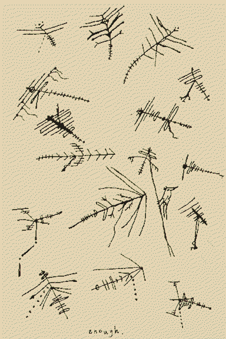
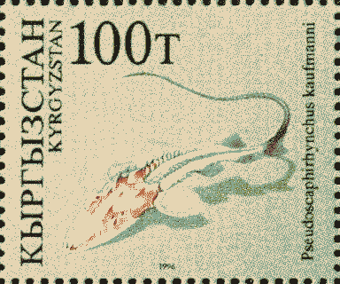

---
aliases:
  - birdsong
  - birdsongs
  - birds
---
# what remains of the outernet

some of the old echoes of [radio](radio.md) have redshifted to visible, but to see all the vectorcritters in the wind u need [autism eyes](Scrimshaw.md)




television for the fish in flooded suburbia

flamboyant featherstars

fibre-optic kite-fins

radiostaceans

lost pilot tones

[love](https://orf.place/love.html) at the [end of a string](skyfill.md)

pesky surveillance stingrays

```
          ~v

~~~ ‘,’,’, > : }

          ~^
```

songbirds spent all that time sitting on antennae, learning how to sing lost digital protocols. I saved a PNG to a bird. starlings have organs to sing in FM/AM, if [radio](radio.md) is ever totally compromised by a flood of [dreams](dream.md).