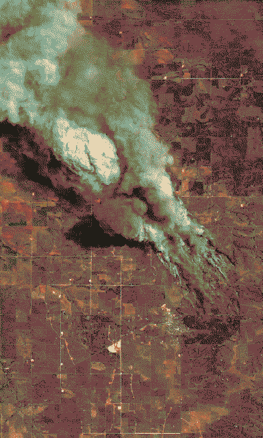

---
aliases:
  - ends of worlds
  - the storm
---
# ends of worlds
whilst everyone dreams of (dreads, remembers, tries to forget, despairs at) a lost or incoming [Utopia](Utopia-Planitia.md) - multiple slow collapses (ecological, geological, psychosocial) have been held in an eternal, unbreaking storm.

yearning to join into one story that makes it all make sense, but they can't.

the [cast](cast.md) might represent different perspectives on this collapse - on a scale of sensitisation-desensitisation, wonder-dread.

## allogenesis
[Monolith](Monolith.md) redefined humanity's [perception of itself](post-anthropocentric.md) as a *networked species* and the repercussions are dreadful/wonderful  - **a collapse of the ability to distinguish between the geological, the biological, the psychological - or a collapse of the dogma delineating these as seperate systems.** 

*it stopped making sense - or being possible - to distinguish fossil from pseudofossil. it became known that the sands had long since stopped following the rhythms of the winds, but were forecasting psychogenic tremors.*

when all context is lost, all that is left is an imprint of many very particular melancholies.