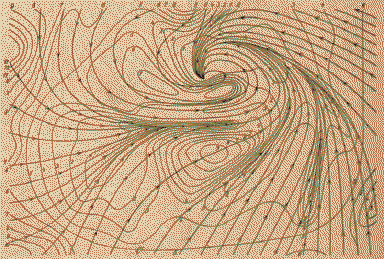
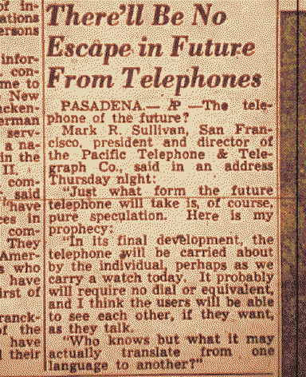
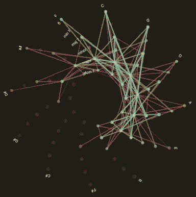
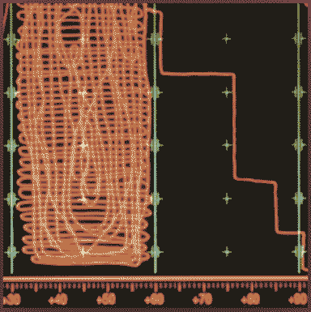
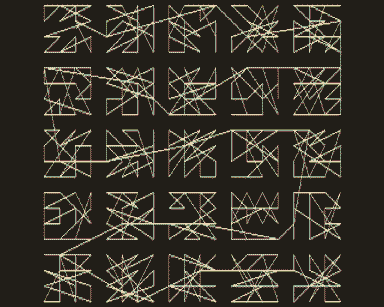

---
aliases:
  - the thingamabob
---

# the doohickey the whatnot etcetera
[Rain](Rain.md) navigates [Mars](Mars.md)' uncanny psychogeography with the help of a thingamabob inhabited by [imaginary friends](Loqui.md) and they bootstrap functionality onto it with the help of [Scrimshaw](Scrimshaw.md) and others. It allows them to become a sort of radio-archaeologist, picking up on frequencies from long-defunct satellite arrays, pirate [radio](radio.md) communications, music between distant lovers and anomalous signals from deep space. Frequency fossicking for the imprint of curios on a 2-dimension oscilloscope.

> They seek voices in the cosmic microwave background, marching to polyrhythms in the music of the spheres.

It has quirky, ‘virtually tactile’ interactions, e.g:
- Has rotational sensitivity so you can control the cursor like you would a ball in a toy maze.
- Creating a multi-line selection actually makes a vertical cursor.
```

h▉llo

e▉

l▉

l▉

o▉

```

whatthreewords, discoordinated.

It has greenhouse gas readers and they can watch the levels plummeting as the climate un-changes.

bad font fallbacks - "error can't connect to central jovian typeface database" -  rendering certain old software unusable.

a **Keeogram** is a way of displaying the intensity of an auroral display - From the Inuit word *Keoeeit* meaning Aurora Borealis.

Comptometers are key-driven mechanical decimal calculators from the turn of the 20th century. They would often have a flip-digit display at the bottom row.

Modular synthesis/metal detectors/artefact sonification

Encoding olfactory data stream, please put your face to the tube to receive the message... *pffffffft*

Crossing the Gobi Desert, Marco Polo wrote of a low hum. The dunes were singing. In the oldest deserts in the world, large dunes that are made up of lots of sand grains of the same size create resonance when they slide over each other.

DXing is searching for [radio](radio.md) broadcasts far away. They don't transmit anything themselves, just listen in. Most DXing happens at night because sunlight effects radio propagation. **At sunset, DXers search for signals from the east - at sunrise, the west.** At midnight, signals from all directions can be heard but interference is high.











